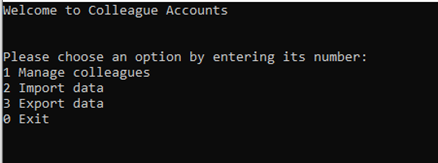
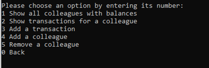
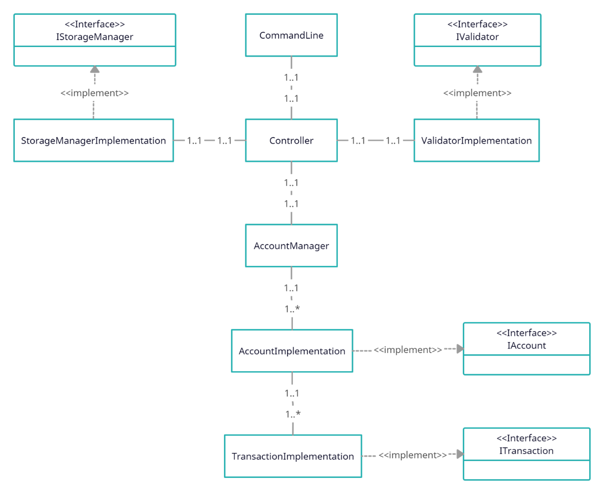

# Colleague Accounts
## Overview
This application was developed from scratch during a coding task. Development time was limited to a few hours, and the code was not altered afterwards. The app is overengineered because the main intention of the task was showcasing code style and architecture.
The purpose of the app is a system to manage loans the user lent to colleagues. The original task was to implement a console application, to provide the possibility to insert data (name and amount), to list all data at once and to save the data in a file. Participants were encouraged to extend the application with useful features.
Features that were implemented additionally are: 
-	import of data from a file
-	every transaction between the user and a colleague has a date and a purpose
-	a balance per colleague is calculated and can be displayed

## User
### Main Menu
When launching the application, the user starts at the main menu.

* 1 Manage colleagues
This option leads to the next menu where colleague accounts can be administrated.
* 2 Import data
The user will be prompted to enter a path to the file. Only .txt files in the correct format (more on that in the developer section) are supported. Data from the file will be added to the current data in the system.
* 3 Export data
Exports all current data in the application to a .txt file. The user will be requested to specify the path and filename.
* 0 Exit
Simply ends the application.
 

### Manage Colleagues
In case the first option (Manage colleagues) is chosen, a new menu opens.

* 1 Show all colleagues with balances
A list with every colleague in the system will show up. In addition to the name the current balance of every colleague will be displayed. The balance is automatically calculated, taking every transaction between the user and this colleague into consideration.
* 2 Show transactions for a colleague
The user will be prompted to enter the colleague’s name. Afterwards the current balance of this colleague and a list of all transactions between the user and this colleague will be displayed.
* 3 Add a transaction
The user enters a colleague’s name, the amount of money transferred, a date for the transaction and an optional purpose. The transaction will be added to the system.
* 4 Add a colleague
A new colleague will be added after the user entered a name.
* 5 Remove a colleague
An existing colleague will be removed from the system after the user entered a name.
* 0 Back
Returns the user to the main menu.

 
## Developer
In regards of naming variables, clear and expressive names have been preferred over short notations. Because of that most classes and methods are self-explanatory when reading the code and therefore do not need many comments. In some cases, comments were added to increase readability and speed up understanding of the code.
The following class-diagram is not fleshed out with properties and methods but shows the general relationships between all classes and interfaces.

The controller launches a command-line which provides an input/output interface for the user. The storage-manager handles import and export of data and the validator has methods to validate user input and imported data. The account-manager contains all accounts related to colleagues whereas each account contains all transactions associated with it.
To enable extensibility, several interfaces were implemented. If desired, additional information can be added to transactions by implementing the ITransaction interface. IAccount provides the possibility of different kinds of accounts, like household accounts. The IValidator interface can be used to implement validators for other date and currency formats but also to add new validations. The IStorageManager interface allows for more flexibility in importing and exporting data. 
The class StorageManagerImplementation imports and exports .txt files in a very simple format. The first line of a file is a header which just contains the column names. Each line represents a transaction with the name of the related colleague in front of it. The name and all fields of a transaction are separated by a tab stop (\t escape character).

## Final Notes
I am not happy with the CommandLine class and how it interacts with the controller. The class is not well-arranged and provides low testability due to how its methods are called from the controller. Additionally, it is not exchangeable. Improving this class would certainly be my top priority if I were reworking the project.
I certainly did not consider all use-cases, especially for importing data and user input. Because of the lack of time, I merely wanted to show that I am aware of the importance of handling incorrect input. In the same way there are just a few unit-tests as examples.
